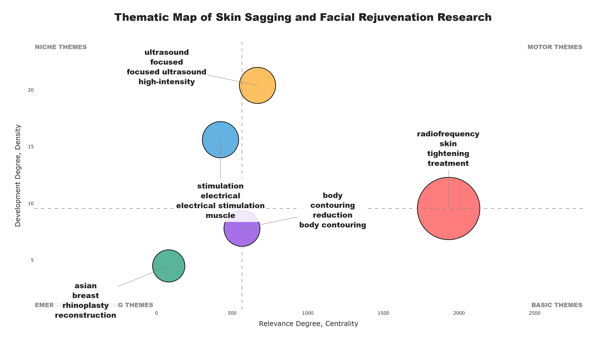
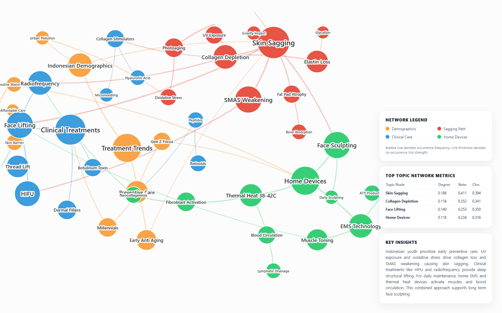
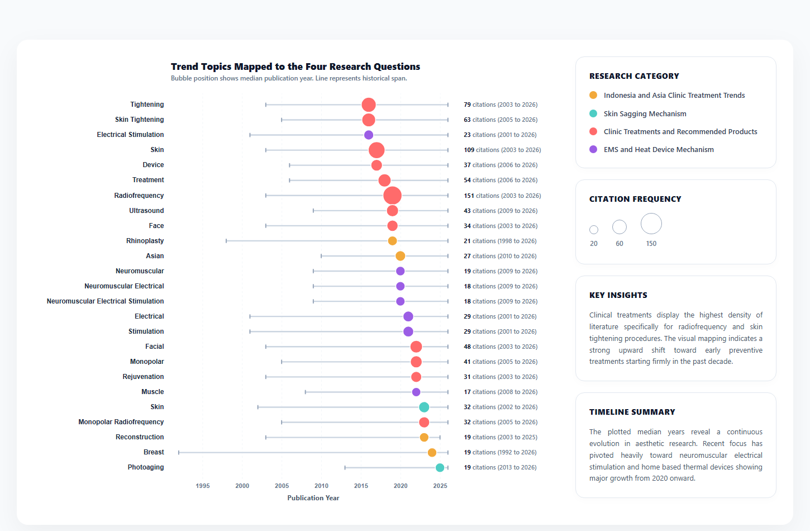
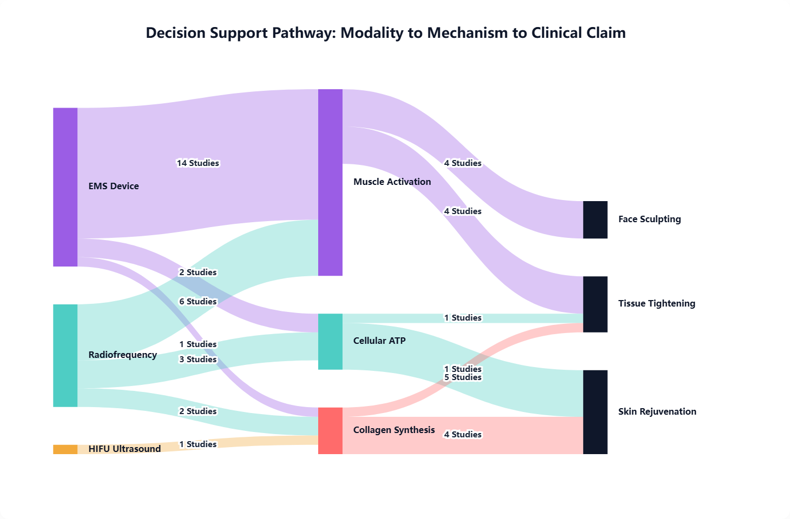
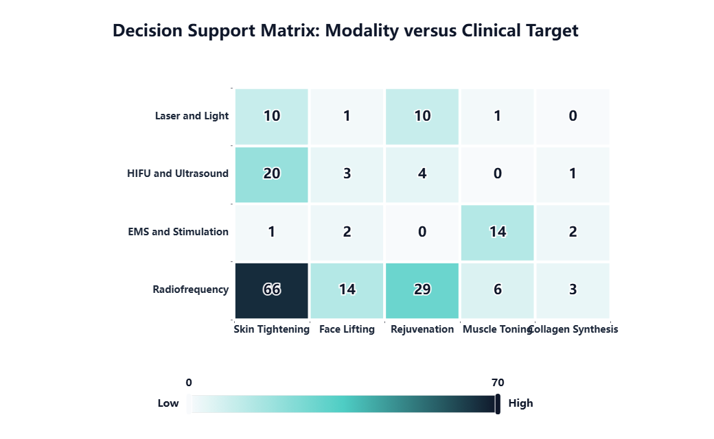
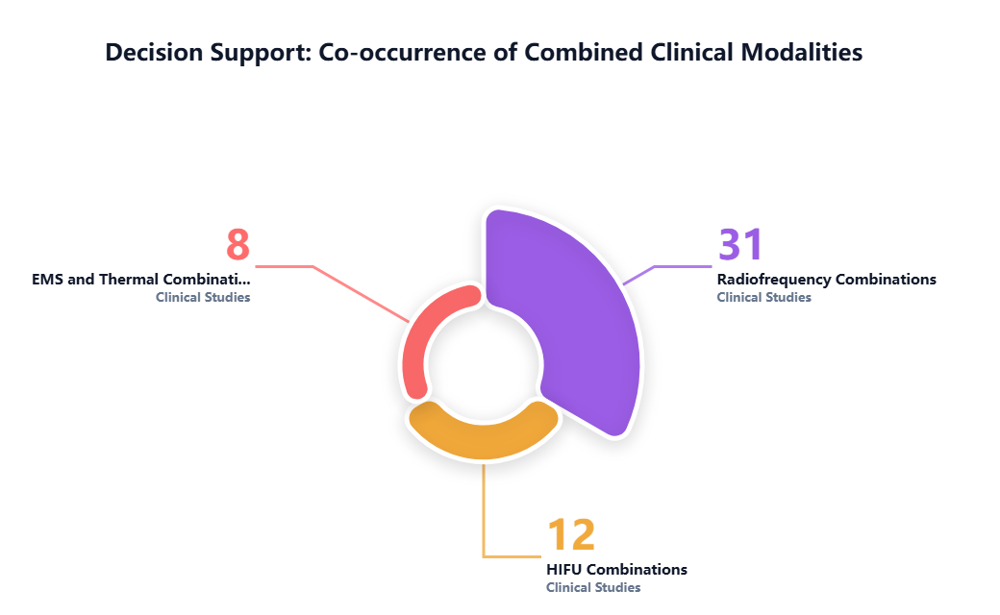
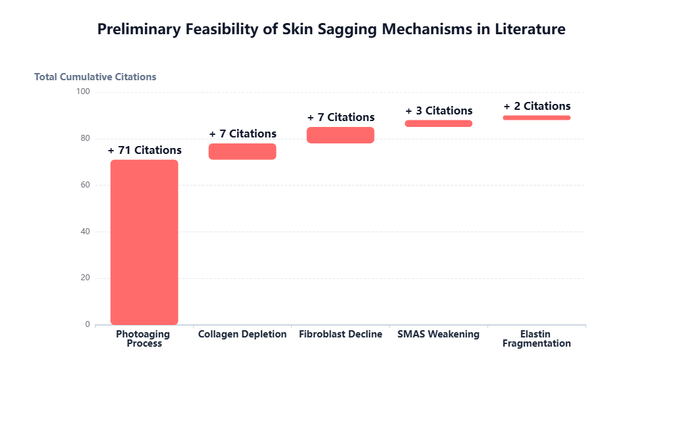
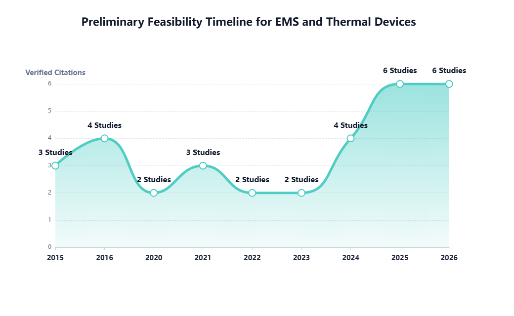
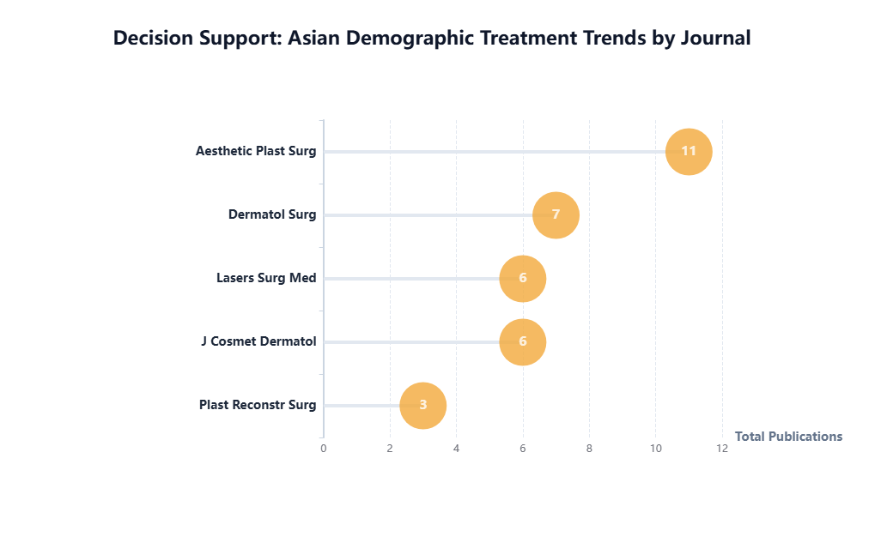

<div align="center">



*A visual analytics workspace for the scoping review of skin laxity mechanisms and non‑invasive aesthetic technologies*

[](LICENSE)


</div>

## Abstract

Skin sagging arises from a convergence of structural changes in the dermis, from collagen depletion and elastin fragmentation to superficial musculoaponeurotic system weakening, and its clinical management now spans a wide spectrum of modalities, from in‑clinic radiofrequency and high intensity focused ultrasound to home use electromagnetic muscle stimulation devices. This repository collects a set of visual analytics built from a literature corpus on the topic, intended to support a scoping synthesis of research trends, thematic clusters, treatment pathways, and modality comparisons. Each chart is implemented as a self contained HTML file so that it can be opened directly in a browser, inspected, or adapted for a manuscript figure, and a matching static image is kept alongside it for quick reference and citation in written reports.

## Repository layout

| Directory | Contents |
|---|---|
| `visualizations/` | Interactive HTML charts built with ECharts, D3.js, and Plotly |
| `figures/` | Static PNG renders of every chart, suitable for direct embedding in slides or manuscripts |
| `scripts/` | The Python source used to generate the bibliometric thematic map |

## Visual gallery

<table>
<tr>
<td width="33%" align="center">
<a href="visualizations/thematic_map_bibliometric.html"></a><br>
<sub><strong>Thematic map</strong><br>Motor, niche, basic, and emerging themes plotted by centrality and density</sub>
</td>
<td width="33%" align="center">
<a href="visualizations/clinical_concept_network.html"></a><br>
<sub><strong>Clinical concept network</strong><br>Co-occurrence graph linking demographics, sagging mechanisms, clinical care, and home devices</sub>
</td>
<td width="33%" align="center">
<a href="visualizations/trend_topics_forest_plot.html"></a><br>
<sub><strong>Trend topics forest plot</strong><br>Publication span and median year for the leading keyword clusters</sub>
</td>
</tr>
<tr>
<td width="33%" align="center">
<a href="visualizations/modality_mechanism_pathway_sankey.html"></a><br>
<sub><strong>Modality to mechanism pathway</strong><br>Flow from device modality through biological mechanism to clinical claim</sub>
</td>
<td width="33%" align="center">
<a href="visualizations/modality_target_matrix_heatmap.html"></a><br>
<sub><strong>Modality versus clinical target matrix</strong><br>Cross tabulation of device category against reported clinical outcome</sub>
</td>
<td width="33%" align="center">
<a href="visualizations/combined_modality_cooccurrence.html"></a><br>
<sub><strong>Combined modality co-occurrence</strong><br>Share of studies reporting a combined treatment protocol</sub>
</td>
</tr>
<tr>
<td width="33%" align="center">
<a href="visualizations/skin_sagging_mechanism_feasibility.html"></a><br>
<sub><strong>Sagging mechanism feasibility</strong><br>Cumulative citation weight across the five leading structural mechanisms</sub>
</td>
<td width="33%" align="center">
<a href="visualizations/ems_thermal_device_timeline.html"></a><br>
<sub><strong>EMS and thermal device timeline</strong><br>Verified citation count for home use electrostimulation and heat devices by year</sub>
</td>
<td width="33%" align="center">
<a href="visualizations/journal_treatment_trends.html"></a><br>
<sub><strong>Journal distribution</strong><br>Publication count for Asian demographic treatment studies by source journal</sub>
</td>
</tr>
</table>

## Working with the interactive charts

The nine HTML files under `visualizations/` require no build step or server. Each one loads its charting library directly from a public CDN (ECharts or D3.js), so an internet connection is needed the first time a chart is opened, after which the browser cache handles subsequent loads. Opening any file in a modern browser reproduces the exact figure shown in the gallery above, with the added benefit of hover tooltips and, for the concept network, a force directed layout that can be dragged and rearranged.

## Reproducing the thematic map

The thematic map is the one visualization generated from a Python script rather than written directly as HTML, since its clustering coordinates come from a bibliometric keyword analysis rather than manually tabulated values.

```bash
pip install plotly kaleido numpy
cd scripts
python thematic_map.py
```

Running the script writes both an interactive HTML file and a static PNG into the `figures/` directory, using the cluster centrality and density values embedded in the script as JSON.

## Interpretive scope

The figures in this repository summarize a preliminary keyword and co-occurrence analysis rather than a completed systematic review with formal risk of bias assessment. Citation counts and study tallies reflect the underlying search corpus at the time of extraction and should be read as descriptive indicators of research volume and topical emphasis, not as pooled effect estimates. Readers drawing clinical conclusions should trace the underlying claims back to the primary literature referenced in the accompanying manuscript.

## License

Released under the [MIT License](LICENSE).
